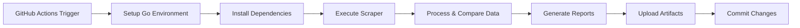

# Automated Car Listing Scraper

A production-ready Go application that automatically monitors car listings from AutoTempest and tracks changes over time. Built with enterprise-grade web scraping techniques and automated CI/CD deployment.

## 🗒️ Purpose

Currently (May 2025), I am trying to buy a car, and in my search have found it extremley tedious to search through various online services to compare prices. I have narrowed my search down to a few cars (less than $20,000, less than 70,000 miles, newer than 2020, Mazda CX-30, Mazda3 or Mazda CX-5). This tool scrapes data twice daily from AutoTempest, a site that already compiles car listings from several sites, and automatically updates a csv of listings as they are added and removed.


## 🚀 Features

- **Real-time Web Scraping**: Uses headless Chrome automation via ChromeDP for JavaScript-heavy websites
- **Change Detection**: Intelligent comparison algorithm identifies new and removed listings
- **Automated Scheduling**: Runs twice daily (6:30 AM/PM EST) via GitHub Actions
- **Data Persistence**: Exports results to CSV format with historical tracking
- **CI/CD Pipeline**: Fully automated with artifact storage and version control
- **Production-Ready**: Optimized for containerized environments with proper error handling

## 🛠 Technology Stack

### Backend & Core Technologies
- **Go 1.24.3**: Modern, performant language choice for concurrent operations
- **ChromeDP**: Advanced browser automation for dynamic content scraping
- **Context Management**: Proper timeout handling and resource cleanup
- **CSV Processing**: Native Go encoding/csv for structured data export

### Infrastructure & DevOps
- **GitHub Actions**: Automated CI/CD pipeline with cron scheduling
- **Artifact Management**: Automated storage with 30-day retention
- **Git Integration**: Automatic commits with change tracking
- **Containerization**: Docker-optimized Chrome flags for headless execution

### Data Processing
- **Concurrent Programming**: Efficient goroutine utilization
- **Memory Management**: Optimized slice operations and resource cleanup
- **Error Handling**: Comprehensive error checking with graceful degradation
- **File I/O**: Atomic file operations with proper locking

## 📋 Current Configuration

Monitors **Mazda CX-30** vehicles with the following criteria:
- **Price Range**: $1,000 - $20,000
- **Year**: 2020+
- **Mileage**: Under 75,000 miles
- **Location**: Within 500 miles of Athens, GA (30605)
- **Transmission**: Automatic only

## 🔄 Automation Workflow



### Scheduling
- **Primary**: Daily at 6:30 AM EST (`30 11 * * *`)
- **Secondary**: Daily at 6:30 PM EST (`30 23 * * *`)
- **Manual**: On-demand via workflow dispatch

## 📊 Output Formats

### 1. CSV Export (`listings.csv`)
Structured data with columns:
- Vehicle Title
- Price
- Mileage
- City/Location
- Distance from target ZIP

### 2. Change Report (`listing_changes.txt`)
Human-readable summary including:
- Timestamp of analysis
- New listings discovered
- Removed listings identified
- Detailed comparison metrics

## 🏗 Architecture Highlights

### Robust Web Scraping
```go
// Production-optimized Chrome configuration
opts := append(chromedp.DefaultExecAllocatorOptions[:],
    chromedp.Flag("headless", true),
    chromedp.Flag("no-sandbox", true),
    chromedp.Flag("disable-dev-shm-usage", true),
    // Additional CI/CD optimizations...
)
```

### Intelligent Change Detection
```go
func compareListings(previous, current []Listing) ([]Listing, []Listing) {
    // Efficient O(n²) comparison algorithm
    // Handles edge cases and data consistency
}
```

### Enterprise Error Handling
- Context-based timeouts (30-second limit)
- Graceful degradation on partial failures
- Comprehensive logging for debugging
- Resource cleanup with defer statements

## 🎯 Skills Demonstrated

**Backend Development**
- Advanced Go programming with modern idioms
- Concurrent programming and goroutine management
- Memory-efficient data structures and algorithms
- Production-ready error handling and logging

**DevOps & Infrastructure**
- GitHub Actions CI/CD pipeline design
- Automated scheduling and workflow orchestration
- Artifact management and retention policies
- Git automation with proper authentication

**Web Scraping & Automation**
- Advanced browser automation with ChromeDP
- JavaScript execution in headless environments
- Dynamic content extraction and parsing
- Anti-detection techniques for production scraping

**Data Engineering**
- ETL pipeline design and implementation
- CSV processing and structured data export
- Change detection algorithms
- File I/O optimization and atomic operations

**Software Engineering Best Practices**
- Clean, maintainable code architecture
- Proper dependency management (go.mod)
- Version control integration
- Documentation and code organization

## 🚀 Getting Started

### Prerequisites
- Go 1.21+
- Chrome/Chromium browser (for local development)

### Local Development
```bash
# Clone the repository
git clone <repository-url>
cd go-practice

# Install dependencies
go mod download

# Run the scraper
go run scraper.go
```

### Automated Deployment
The application automatically deploys via GitHub Actions. Simply push changes to trigger the CI/CD pipeline.

## 📈 Monitoring & Analytics

- **Execution Logs**: Available in GitHub Actions workflow runs
- **Data Artifacts**: Downloadable CSV and change reports
- **Historical Tracking**: Git commit history provides audit trail
- **Performance Metrics**: Execution time and resource usage tracking

---

*This project demonstrates production-ready Go development, advanced web scraping techniques, and modern DevOps practices suitable for enterprise environments.*